# State machines from frozen source

Only names present in frozen source or the traced legacy/admin source are used. Dashed arrows mean a declared/repository transition whose runtime executor is absent. Red notes are gaps, not desired architecture.

## 1. Game aggregate

Source: `packages/games/src/index.ts:4-11,141-165`; persistence: `games.games.lifecycle_state` in `0023_games_foundation.sql`.

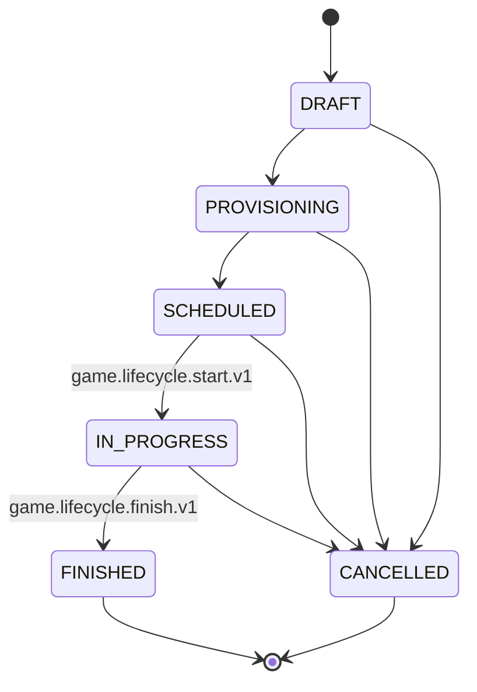

| From                                      | Command/actor                 | Guard/lock                                                    | To and writes                                                 | Event/recovery                                                   | Runtime status                                    |
| ----------------------------------------- | ----------------------------- | ------------------------------------------------------------- | ------------------------------------------------------------- | ---------------------------------------------------------------- | ------------------------------------------------- |
| absent                                    | `GameRepository.create`, user | canonical range; idempotency advisory; one tenant transaction | PROVISIONING, revision 1, organizer ACTIVE, PENDING operation | created + provisioning requested; schedules provisioning advance | Repository only; no route/executor in frozen main |
| absent                                    | PR #135 free create           | free-only validated body; same lock                           | SCHEDULED, revision 1                                         | created + scheduled + optional published; schedules start/finish | PENDING_PR                                        |
| SCHEDULED                                 | lifecycle scanner/system      | claim lease, game `FOR UPDATE`, due time, expected revision   | IN_PROGRESS, revision +1                                      | `game.started.v1`; retry <=20                                    | FEATURE_GATED; executor exists                    |
| IN_PROGRESS                               | lifecycle scanner/system      | same                                                          | FINISHED, revision +1, result state AWAITING_SUBMISSION       | `game.finished.v1`                                               | FEATURE_GATED                                     |
| PROVISIONING/SCHEDULED                    | PR #135 organizer cancel      | owner, free, row lock, state/payment CAS                      | CANCELLED, cancellation fields, revision +1                   | `game.cancelled.v1`; no downstream compensation                  | PENDING_PR                                        |
| mapped scheduled/in-progress legacy clone | legacy importer/system        | legacy snapshot and merge/ownership fences                    | CANCELLED/VOID result                                         | `game.cancelled.v1`                                              | FEATURE_GATED legacy sync                         |

Invalid transitions are rejected by `assertLifecycleTransition`; frozen main has no public start/finish/cancel handler. FINISHED and CANCELLED are terminal in the domain vocabulary.

## 2. Participation/roster

Persistence has three separate active containers: `participations`, `seat_reservations`, `waitlist_entries`. There is no cross-table database constraint; the game row lock plus application policy is the exclusivity boundary.

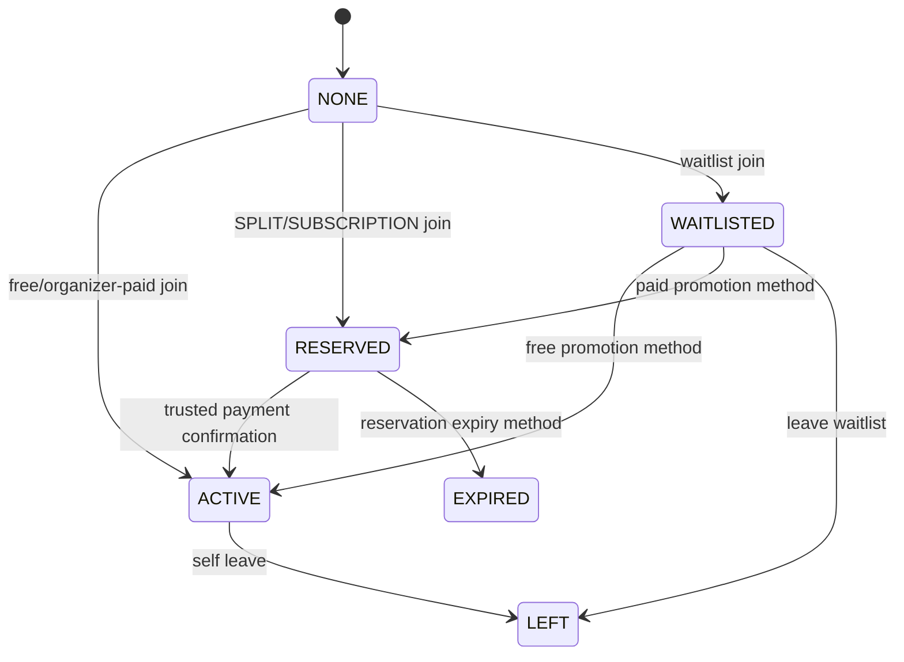

The concrete `games.participations.state` vocabulary is `ACTIVE|LEFT|REMOVED`; no lk2 writer sets `REMOVED`. Viewer relation derives `ORGANIZER|PARTICIPANT|SEAT_RESERVED|WAITLISTED|NONE`. `assertNewRosterUser` rejects simultaneous roles before every new entry.

| Command         | Ordered guards                                                                                   | Lock/revision                                                                | State/write                       | Event                                                                | Gap                                         |
| --------------- | ------------------------------------------------------------------------------------------------ | ---------------------------------------------------------------------------- | --------------------------------- | -------------------------------------------------------------------- | ------------------------------------------- |
| join            | facts sanity → new viewer → SCHEDULED → cutoff → capacity → eligibility                          | idempotency advisory → game `FOR UPDATE` → facts; optional expected revision | NONE→ACTIVE or RESERVED           | confirmed/reserved; optional roster completed                        | paid completion/expiry not closed           |
| join waitlist   | facts → new viewer → SCHEDULED → cutoff → capacity must be full → waitlist enabled → eligibility | same                                                                         | NONE→WAITLISTED, ordered position | waitlist joined                                                      | notifications absent                        |
| leave           | facts → organizer forbidden → active participant → SCHEDULED → cutoff                            | same                                                                         | ACTIVE→LEFT                       | participation left; optional roster reopened and scheduled promotion | paid compensation absent; promotion unwired |
| leave waitlist  | facts → WAITLISTED → SCHEDULED                                                                   | same                                                                         | WAITLISTED→LEFT                   | waitlist left                                                        | no cutoff guard by domain design            |
| confirm payment | trusted bridge identity/mapping/snapshot/reservation/evidence                                    | game and reservation rows; provider-operation advisory                       | RESERVED→ACTIVE; payment PAID     | participation confirmed                                              | provider semantic binding incomplete        |

## 3. Invitation

Two invitation concepts exist and must not be conflated.

### `games.invitations`

Vocabulary: `ACTIVE|REVOKED|EXPIRED|CONSUMED` in `0023_games_foundation.sql:241-263`. No route/repository writer was found. It is schema-only.

```mermaid
stateDiagram-v2
  [*] --> ACTIVE: schema permits insert; no writer found
  ACTIVE --> REVOKED: no writer found
  ACTIVE --> EXPIRED: no executor found
  ACTIVE --> CONSUMED: no writer found
```

### `eligibility.personal_invitations`

Vocabulary: `ACTIVE|USED|REVOKED|EXPIRED` in `0084_participation_level_eligibility.sql`. Join/waitlist/promotion can validate a PERSONAL invitation exactly by tenant, activity type/id, recipient, status, expiry and use count under `FOR UPDATE`. Only a `PERSONAL_INVITE_BYPASS` consumes it (`use_count+1`, `used_at`, possibly `USED`). No issue/revoke/decline endpoint exists.

## 4. Waitlist

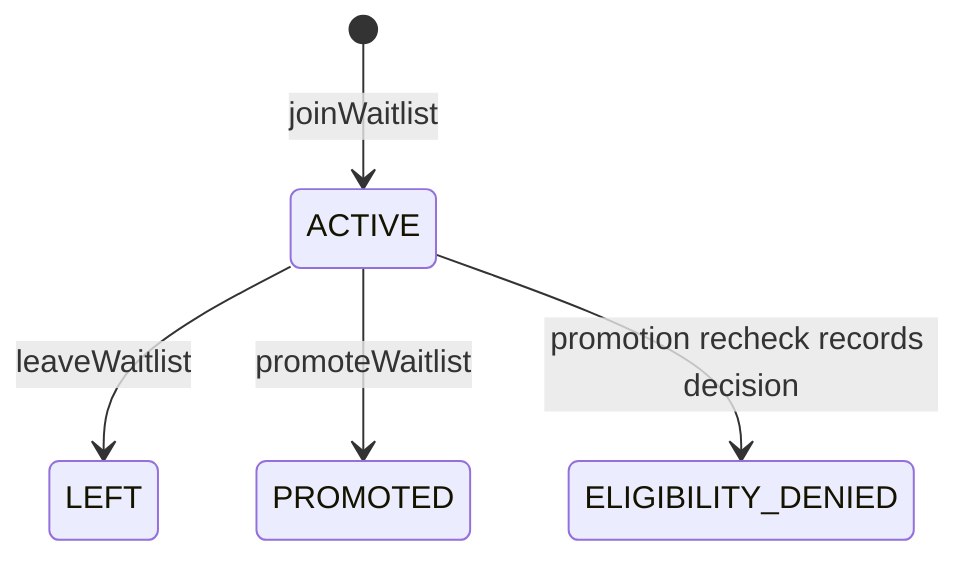

`ELIGIBILITY_DENIED` is not a database state; the entry remains/reorders according to repository behavior and decision recording. Automatic promotion is incomplete because no worker invokes `promoteWaitlist`. The repository locks the game, checks capacity, selects the first ACTIVE position and rechecks eligibility. Paid promotion creates a reservation; its expiry is also unwired.

## 5. Seat reservation

State: `ACTIVE|CONFIRMED|EXPIRED|CANCELLED`; payment: `REQUIRES_ACTION|PROCESSING|PAID|FAILED|EXPIRED`.

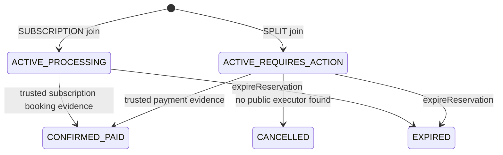

Creation uses a 15-minute expiry and schedules `game.reservation.expire.v1`. The repository expiry transition is atomic and emits expired/reopened facts, but the runtime scanner never claims that command type. There is no public pay/retry endpoint and `getOperation` returns the stored reservation result rather than a later payment-converged result.

## 6. Command, operation and idempotency

`games.command_idempotency`: `IN_PROGRESS|COMPLETED|FAILED`. `games.operations`: `PENDING|PROCESSING|SUCCEEDED|FAILED|CANCELLED`. Scheduled commands: `PENDING|PROCESSING|COMPLETED|FAILED`.

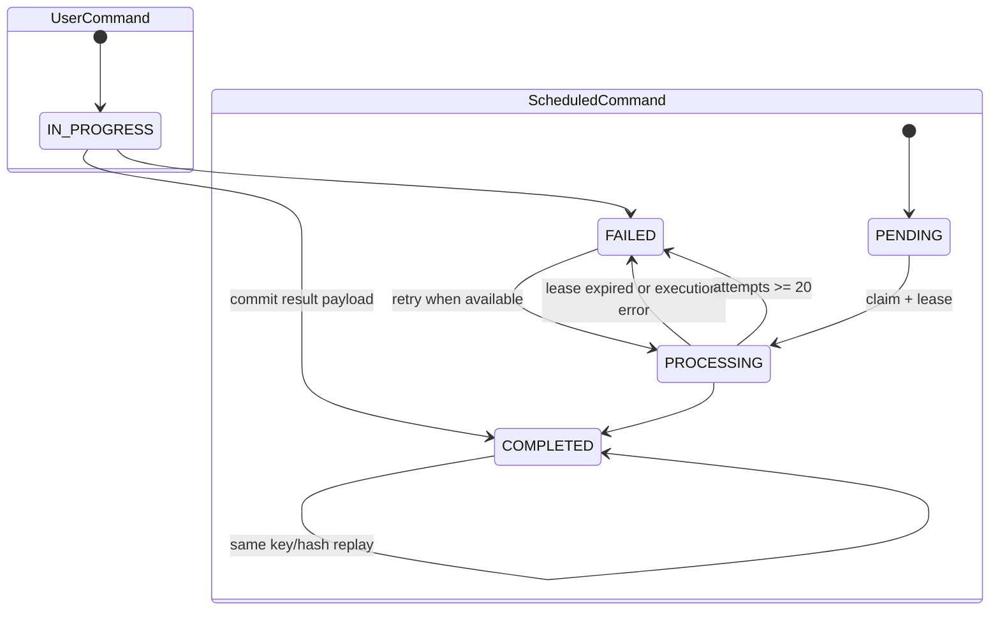

Same key with a different request hash is `IDEMPOTENCY_KEY_REUSED`. User paths acquire the transaction advisory key before the game row. Lifecycle claim uses `FOR UPDATE SKIP LOCKED`; only start/finish are selected. Create operation is PENDING in frozen repository because provisioning advance has no executor. PR #135 free create/cancel stores SUCCEEDED management operations and exposes them in operation readback.

## 7. Booking/provider booking

There is no native lk2 provider-booking state machine. `games.games.booking_id` is nullable; create writes no provider booking. LK2 receives payment confirmation evidence from a trusted legacy bridge and stores provider booking/exercise/client identifiers. Viva remains VIVA_PRIMARY.

The only concrete distributed booking cancellation state machine in scope is legacy durable leave:

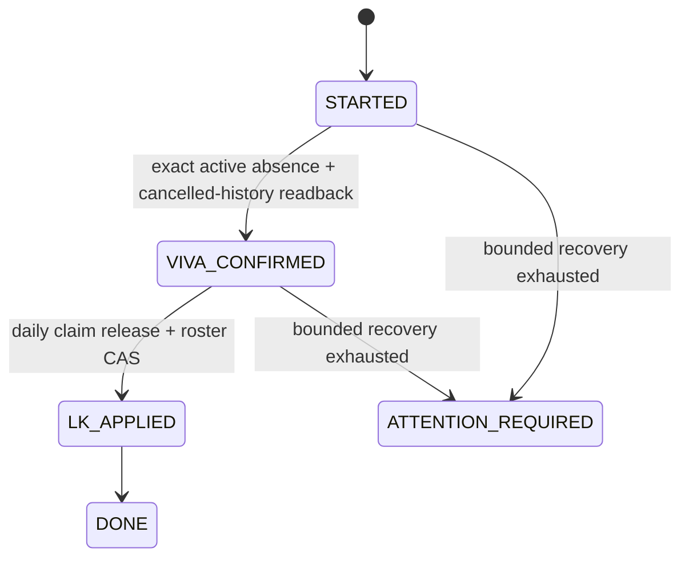

This is LEGACY_ACTIVE source, not native lk2 behavior, and deployment/provider persistence was not verified.

## 8. Payment attempt

Native Games has payment vocabulary and evidence, not a complete payment-attempt saga.

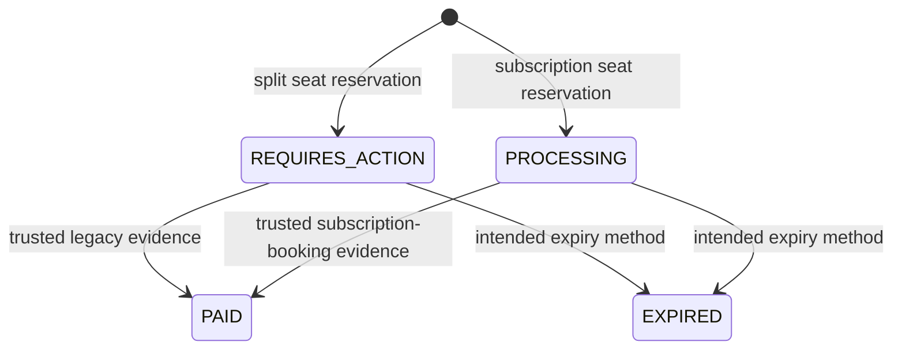

Missing states/paths: durable local attempt before provider POST, single provider-call claim, expected quotation amount/currency binding, ambiguous timeout state, provider read/reconcile and public completion. `payment_confirmation_evidence` journals APPLIED/REJECTED evidence with unique provider operation and reservation, but `provider_exercise_id` is intentionally nullable and no expected booking/amount/currency comparison is made.

## 9. Subscription entitlement/write-off

No native Game entitlement state machine exists. `SUBSCRIPTION` join creates a PROCESSING reservation and immutable eligibility payment snapshot. The subscription runtime route is an advisory, non-binding quote requiring reservation recheck; the join flow does not call it. There is no consume, recheck, release or reconcile executor in lk2.

Legacy managed-subscription/daily-claim paths exist, but activation/provider persistence are outside the source proof. Do not infer entitlement consumption from `payment_mode='SUBSCRIPTION'`.

## 10. Refund/reversal

Participation payment vocabulary includes `REFUND_PENDING|REFUNDED`, but no lk2 writer transitions to either value. There is no refund operation table/route/idempotency identity/reconciliation worker and no cancel compensation saga.

```mermaid
stateDiagram-v2
  PAID --> REFUND_PENDING: vocabulary only; no writer
  REFUND_PENDING --> REFUNDED: vocabulary only; no writer
```

Legacy staff leave supports RETURN_VISIT or NO_RETURN and a durable provider/local state machine. It is not a native compensation path.

## 11. Result and rating

Game result states: `NOT_AVAILABLE|AWAITING_SUBMISSION|PENDING_CONFIRMATION|CONFIRMED|DISPUTED|VOID`.

```mermaid
stateDiagram-v2
  NOT_AVAILABLE --> AWAITING_SUBMISSION: lifecycle finish
  AWAITING_SUBMISSION --> PENDING_CONFIRMATION: submit
  DISPUTED --> PENDING_CONFIRMATION: resubmit; old submission SUPERSEDED
  PENDING_CONFIRMATION --> CONFIRMED: non-author confirmation; quorum 1
  PENDING_CONFIRMATION --> DISPUTED: non-author dispute
  CONFIRMED --> VOID: legacy cancellation/import only
```

Submit guards: FINISHED, within 48 hours for first submission, active participant, exactly four active participants and exact roster match. Confirm/dispute requires another active participant and a pending submission. Confirmation inserts normalized results/sets/players atomically and emits `game.result.confirmed.v1`; local history/facts and optional CUP rating consume it. No edit/correct/revert/void public handler exists.

Migration allows confirmation quorum 1–3, but submission hardcodes 1. Repository confirmation throws if reviews are below configured quorum instead of accumulating them, so quorum >1 is not supported behavior.

## 12. GAME chat authorization

```mermaid
stateDiagram-v2
  [*] --> DENIED
  DENIED --> HTTP_AUTHORIZED: identity ACTIVE + games.play + contextual/http enabled + participation ACTIVE
  HTTP_AUTHORIZED --> DENIED: leave/remove or permission/user/runtime revocation
  HTTP_AUTHORIZED --> REALTIME_AUTHORIZED: PR #137 only; realtime enabled + conversation subscription recheck
  REALTIME_AUTHORIZED --> DENIED: participation/session/permission revoked
```

Frozen HTTP list/get/create/send/read rechecks canonical `games.participations.state='ACTIVE'`; stale messaging membership alone grants nothing. Reserved/waitlisted users are denied. Lifecycle CANCELLED/FINISHED is not checked; if participation remains ACTIVE, HTTP chat can remain available. Frozen realtime authorization is direct-chat-only. PR #137 adds contextual GAME connection/subscription/recipient rechecks and concurrency tests, but it is pending.

## 13. Projection/read-model freshness

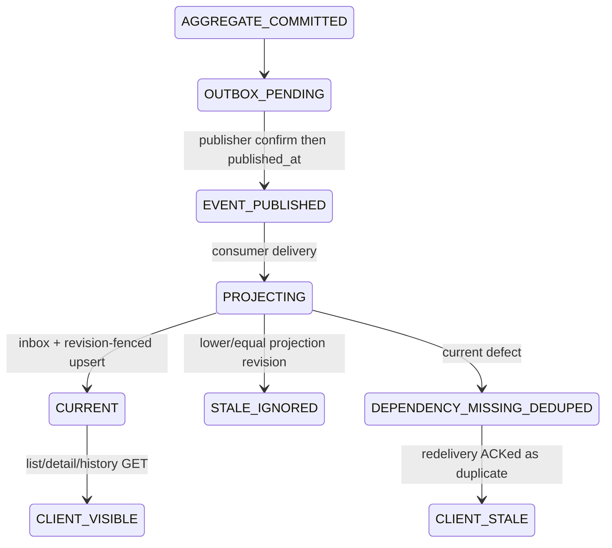

Card/public caches can add 15 seconds max-age plus 30 seconds stale-while-revalidate; recommendation server cache can be five minutes and web first-page cache 60 seconds. The UI polls a bounded two seconds for roster/result paths and does not require the projected revision to reach the command `aggregateRevision`. PR #135 created-detail polling is about three seconds, also bounded.

The defect transition is source-confirmed: projector repository commits/marks inbox processing before returning `dependency_missing`/`result_not_found`; the consumer nacks; redelivery returns duplicate and is ACKed. No reconciliation/rebuild consumer was found.
