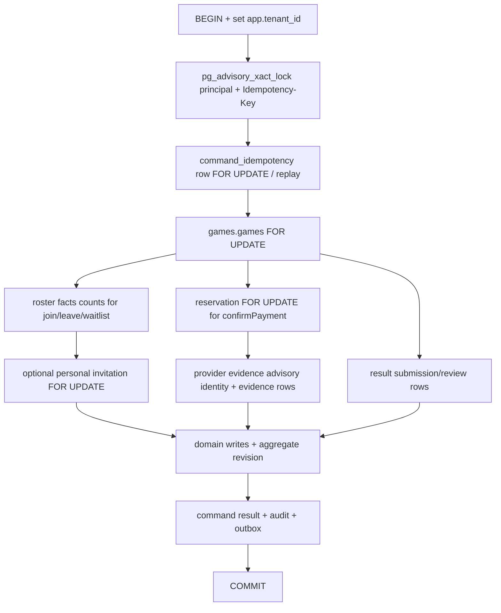

# Concurrency, idempotency and recovery

## Transaction and lock graph



The consistent user roster lock order is idempotency advisory → command row → aggregate row → subordinate facts. Last-seat writes serialize on the aggregate before counts. Result commands use idempotency advisory → aggregate row → result rows. Scheduled lifecycle execution locks the claimed command then the aggregate. No concrete cyclic order was found in these methods.

## Database invariants

| Invariant                              | Mechanism                                                                                            | Residual risk                                                                                    |
| -------------------------------------- | ---------------------------------------------------------------------------------------------------- | ------------------------------------------------------------------------------------------------ |
| Tenant isolation                       | transaction-local `app.tenant_id`; RLS enabled and forced on Games tables                            | Applied migration/grant/runtime role is UNKNOWN.                                                 |
| Same command replay                    | advisory key; command unique `(tenant_id,principal_key,idempotency_key)`; stored request hash/result | New browser invocation creates a new key unless UI persists it.                                  |
| Last seat                              | game row `FOR UPDATE` before active participation + reservation count                                | Only local PostgreSQL writers are serialized; legacy dual ownership must remain gated/mirrored.  |
| One active participation per user/game | partial unique                                                                                       | Cross-table participation/reservation/waitlist exclusivity is application-only.                  |
| One active reservation per user/game   | partial unique                                                                                       | Expiry runner absent.                                                                            |
| Waitlist order                         | unique active position + game lock                                                                   | Promotion runner absent.                                                                         |
| Provider operation evidence            | advisory identity + unique provider operation; unique reservation evidence                           | Evidence not bound to expected game exercise/booking/quotation.                                  |
| Projection order                       | projection revision fence                                                                            | Dependency-missing inbox bug can suppress retry/rebuild.                                         |
| Event duplicate                        | inbox unique `(consumer,event)`                                                                      | Consumers must rollback on retriable dependency failure; current card/result projector does not. |

## Race decision table

| Race                                   | Serialization/preimage                                        | Expected winner/result                | Source result                     | Gap/test                                                        |
| -------------------------------------- | ------------------------------------------------------------- | ------------------------------------- | --------------------------------- | --------------------------------------------------------------- |
| Two users join last seat               | both lock same game before count                              | first commits; second sees full       | locally safe                      | unit SQL-order evidence; no frozen real-Postgres last-seat test |
| Same user double-click join            | same invocation SDK key; server advisory/command replay       | one mutation + replay                 | safe if same key                  | two separate UI invocations use different keys                  |
| Same key, different payload            | request hash mismatch                                         | 409 `IDEMPOTENCY_KEY_REUSED`          | implemented                       | strong route/repository tests                                   |
| Join with stale revision               | aggregate lock then compare                                   | 409 `GAME_REVISION_CONFLICT`          | implemented                       | optional revision means omission accepts newest state           |
| Join vs cancel                         | frozen cancel absent; PR #135 cancel locks aggregate          | one locked preimage should win        | not tested end-to-end             | PR cancel/roster composition needs real PostgreSQL race test    |
| Leave vs promotion                     | leave commits scheduled promotion row                         | promotion should claim after commit   | no executor                       | permanent free slot/waitlist stall                              |
| Leave vs join                          | aggregate row serializes                                      | post-leave join can take seat         | local methods safe                | missing real-Postgres composed test                             |
| Leave vs result submit                 | aggregate row serializes; result exact-four roster guard      | one sees changed roster               | source guards exist               | no behavior test; policy after start blocks leave normally      |
| Cancel vs waitlist promotion           | cancellation and promotion should share game lock/state guard | cancellation should prevent promotion | PR cancel + orphan promotion      | no executor/composed test                                       |
| Concurrent result confirmation/dispute | game row lock + state/review uniqueness                       | first terminal transition wins        | likely local safety               | result repository has no behavioral concurrency suite           |
| Concurrent GAME message sends          | conversation row allocation                                   | unique sequences                      | main has weaker idempotency scope | PR #137 adds advisory locks + real PostgreSQL tests             |

## Command replay lifecycle

1. Route requires Idempotency-Key.
2. Repository computes/receives a SHA-256 request hash including command, game and payload.
3. Transaction advisory lock serializes the principal/key.
4. Existing completed row with same type/hash returns stored result with `replayed=true`.
5. Different type/hash or invalid state returns conflict.
6. Domain rows, immutable command result, audit and outbox commit together.

Lost response after local commit is safe if the caller reuses the same key. SDK `retryOnceOnNetworkFailure` does that only inside one method invocation. User-driven retry after page reload/new invocation uses a newly generated key; aggregate guards often prevent duplicate roster membership, but create PR #135 can create a second free game after an ambiguous committed first request because the browser does not persist the original intent/key.

## Scheduled command recovery

`claimScheduledCommands` resets PROCESSING leases older than 60 seconds to FAILED, selects PENDING or FAILED rows with `FOR UPDATE SKIP LOCKED`, increments attempts and caps at 20. The worker only requests:

- `game.lifecycle.start.v1`;
- `game.lifecycle.finish.v1`.

It never claims:

- `game.provisioning.advance.v1`;
- `game.reservation.expire.v1`;
- `game.waitlist.promote.v1`;
- `game.integration.reconcile.v1`.

Therefore the presence of `scheduled_commands` rows and tested repository methods is not a recovery path.

## Outbox and consumer recovery

Outbox publisher publishes with broker confirm before setting `published_at`. A crash after broker confirm but before database update duplicates delivery; consumers must be idempotent.

Card/result consumers use quorum queues and delivery limits, then DLX. Their retriable dependency branches are defective:

```text
consumer receives event
→ repository inserts/claims audit.inbox_events
→ dependency missing
→ repository commits processed/claim state and returns dependency_missing
→ consumer throws + nack(requeue=true)
→ redelivery finds inbox duplicate
→ repository returns duplicate
→ consumer ACKs
→ projection remains stale; no rebuild job found
```

Required fix boundary is to ensure a retriable dependency outcome rolls back/removes the inbox claim or records a retryable state that redelivery can own. This audit does not implement it.

## Provider/payment invariant table

| Required invariant                               | Native Game evidence                                                                             | Verdict                                   |
| ------------------------------------------------ | ------------------------------------------------------------------------------------------------ | ----------------------------------------- |
| Durable local attempt before provider POST       | Public/native provider POST absent                                                               | NOT_IMPLEMENTED; cannot pass paid journey |
| Single claim owns provider call                  | no native provider caller                                                                        | NOT_IMPLEMENTED                           |
| One intent cannot create multiple provider POSTs | no native provider caller                                                                        | NOT_IMPLEMENTED                           |
| Local/external IDs separated                     | evidence table has separate IDs                                                                  | PASS at schema level                      |
| Tenant bound to provider account                 | bridge tenant/mapping checks; provider account ownership not read back                           | NOT_PROVEN                                |
| Amount/currency bound to quotation               | stored but no expected quotation comparison                                                      | FAIL                                      |
| Ambiguous timeout becomes unresolved/reconcile   | no native state/path                                                                             | FAIL                                      |
| Provider read/reconcile                          | none in lk2                                                                                      | FAIL                                      |
| Response bound before truth                      | identity/evidence type strong; exercise/booking/price weak                                       | FAIL                                      |
| Secrets/PII absent from logs                     | explicit structured logs vary; payment evidence contains phone; broad runtime logging not proven | NOT_PROVEN                                |
| Refund has own idempotency identity              | no native refund                                                                                 | FAIL                                      |
| Entitlement restored once                        | no native restore                                                                                | FAIL                                      |

The trusted bridge uniquely journals provider operation and reservation evidence, checks actor/reservation/mode and rejects late confirmations. It deliberately accepts missing exercise binding and does not compare booking/amount/currency to an expected quotation. No Viva readback follows.

## Legacy durable leave recovery

The LK1 staff/self leave flow is the only concrete in-scope distributed compensation process:

- persist STARTED before Viva mutation;
- 90-second claim leases and bounded retry;
- exact cancelled-history readback;
- release the exact daily subscription claim when present;
- apply roster generation CAS;
- terminal DONE or ATTENTION_REQUIRED.

It is source evidence only. Fresh git main is not a live flow hash and no provider request/read occurred.

## CUP rating recovery

The client sends `Idempotency-Key: game-result:{resultId}:v{revision}` and maps a duplicate response. The quorum queue retries to delivery limit 8 and then DLQs. Missing:

- local delivery/operation journal;
- provider status readback;
- ambiguous timeout classification;
- DLQ reconciliation worker;
- proven remote idempotency durability.

Thus source demonstrates an idempotency request, not end-to-end rating exactly-once behavior.

## Client recovery and projection lag

| Client path            | Recovery                                    | Limitation                                                         |
| ---------------------- | ------------------------------------------- | ------------------------------------------------------------------ |
| roster command         | operation poll 8×250ms, then one game GET   | does not require projected revision to reach operation revision    |
| result command         | game GET 8×250ms                            | success notice can appear before confirmed projection              |
| PR #135 created detail | game GET up to 12×250ms                     | bounded; no durable create intent recovery                         |
| GAME chat main         | HTTP history + 5s polling                   | no GAME websocket fanout                                           |
| PR #137 GAME chat      | realtime hints + sequence-gap HTTP recovery | PR pending; transient broker queue still requires HTTP correctness |

## Deadlocks, lock timeouts and manual recovery

No explicit deadlock/serialization-failure retry wrapper or stable lock-timeout API error mapping was found for Game commands. PostgreSQL errors would generally become generic server errors. PR #137 adds lock-timeout/deadlock-focused PostgreSQL tests for messaging, not the whole Game aggregate.

There is no complete runbook to inspect/replay the four orphan scheduled command types or rebuild card/result projections after dependency-missing dedup. Manual mutation was not attempted and would require a separate R4 procedure with exact target, rehearsal, backup, idempotency and readback.

## Terminal and unresolved states

| Process                        | Proven terminal                                      | Unresolved/stuck possibility             |
| ------------------------------ | ---------------------------------------------------- | ---------------------------------------- |
| free local join/leave/waitlist | command COMPLETED and aggregate revision committed   | projection may remain stale              |
| paid join                      | reservation ACTIVE, command COMPLETED/API PROCESSING | no expiry/payment/public completion      |
| lifecycle start/finish         | scheduled command COMPLETED/FAILED                   | only if read gate enables worker         |
| frozen repository create       | game PROVISIONING, operation PENDING                 | no provisioning executor                 |
| result confirm                 | local CONFIRMED                                      | external CUP rating unknown/DLQ          |
| notification                   | none                                                 | no Game consumer                         |
| GAME chat HTTP                 | authorized/denied on each request                    | cancellation retention policy unresolved |
| legacy staff leave             | DONE/ATTENTION_REQUIRED by source contract           | live/provider truth UNKNOWN              |
