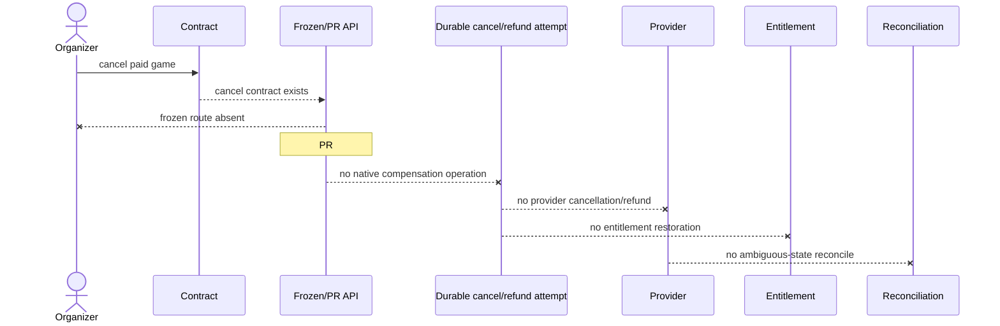
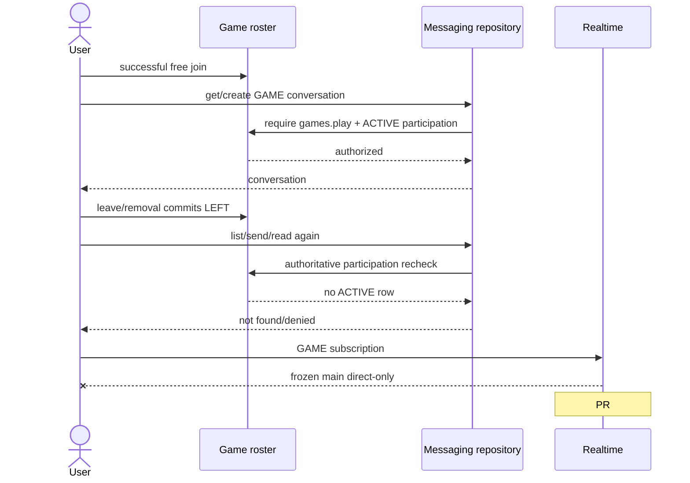

# Sequence diagrams

Solid participants/arrows are frozen-main source unless a participant is labelled PR or LEGACY. `X` is a missing layer, not an implementation proposal.

## 1. Free create

Frozen main has no route; PR #135 is shown explicitly.

```mermaid
sequenceDiagram
  actor U as User
  participant W as CreateGamePage (PR #135)
  participant S as SDK (PR #135)
  participant A as API route (PR #135)
  participant D as GameRepository
  participant P as PostgreSQL
  participant O as Outbox/worker
  participant R as Card read model
  U->>W: Submit free NO_PAYMENT form
  W->>S: createGame(input)
  S->>A: POST /games + Idempotency-Key
  A->>A: auth, games.play, tenant, validate time/range/free-only
  A->>D: create(..., joinCutoffAt)
  D->>P: advisory key; transaction inserts SCHEDULED game, organizer, operation, lifecycle commands, idempotency, audit, outbox
  P-->>D: commit revision 1
  D-->>A: applied, SUCCEEDED, gameId
  A-->>W: 202 GameCommandResult, game=null
  W->>W: navigate /games/:id?created=1
  O->>R: game.# project card
  W->>R: bounded detail polling
  Note over U,R: Frozen main stops before SDK/API. PR exact-head checks are red.
```

## 2. Paid/provider-backed create — absence proof

```mermaid
sequenceDiagram
  actor U as User
  participant C as Frozen contract
  participant A as Frozen API
  participant T as Durable provider attempt
  participant V as Viva/provider
  participant Q as Reconciliation
  U->>C: Intended paid create
  C-->>A: create schema exists
  A--xU: No registered create handler
  A--xT: No durable payment/booking attempt
  T--xV: No native provider POST
  V--xQ: No read/reconcile path
  Note over U,Q: NOT_IMPLEMENTED; provider success/reject/ambiguous scenarios have no native chain.
```

## 3. Successful free join

```mermaid
sequenceDiagram
  actor U as Player
  participant W as GamesPage
  participant S as SDK
  participant A as Game route
  participant D as Roster repository/domain
  participant P as PostgreSQL
  participant B as Broker/card projector
  W->>S: joinGame(gameId, expectedRevision?)
  S->>A: POST /games/:id/join + same retry key
  A->>A: authenticate → games.play → tenant → Idempotency-Key → body
  A->>D: join(principal, hash, revision)
  D->>P: advisory key → command replay → game FOR UPDATE → roster facts
  D->>D: lifecycle → cutoff → capacity → eligibility
  D->>P: insert ACTIVE participation; revision+1; command/audit/outbox
  P-->>D: COMMIT
  D-->>A: PARTICIPANT, revision
  A-->>W: 200 SUCCEEDED, game=null
  W->>A: GET operation (bounded)
  B->>P: consume game.# and upsert card projection
  W->>A: GET game detail
```

## 4. Two concurrent joins on the last seat

```mermaid
sequenceDiagram
  actor A1 as Player A
  actor A2 as Player B
  participant R as Roster repository
  participant G as games.games row
  participant C as roster counts
  A1->>R: join key A
  A2->>R: join key B
  R->>G: A SELECT FOR UPDATE
  R->>G: B waits on same row
  R->>C: A counts one free seat
  R->>G: A insert participation + revision; COMMIT
  G-->>R: B lock acquired
  R->>C: B counts no free seat
  R-->>A2: 409 GAME_FULL
  R-->>A1: 200 SUCCEEDED
  Note over A1,C: Per-aggregate local serialization; no real-Postgres frozen test proves this composed race.
```

## 5. Join with subscription

```mermaid
sequenceDiagram
  actor U as Player
  participant A as API
  participant D as Roster repository
  participant P as PostgreSQL
  participant X as Subscription/provider completion
  A->>D: join paymentMode=SUBSCRIPTION
  D->>P: lock game, evaluate eligibility, insert immutable payment snapshot
  D->>P: insert ACTIVE seat reservation payment_state PROCESSING, expires+15m
  D->>P: insert game.reservation.expire.v1 + command/audit/outbox
  P-->>A: COMMIT
  A-->>U: 202 PROCESSING, nextAction NONE
  U->>A: GET operation repeatedly
  A-->>U: same stored PROCESSING result
  D--xX: no entitlement consume/recheck/provider call
  Note over U,X: MAIN_PARTIAL; advisory subscription quote is not called from this chain.
```

## 6. Join requiring payment/reservation and trusted confirmation

```mermaid
sequenceDiagram
  actor U as Player
  participant A as Public API
  participant D as Roster repository
  participant P as PostgreSQL
  participant L as Legacy bridge (gated)
  participant V as Verified legacy evidence
  A->>D: SPLIT join
  D->>P: ACTIVE reservation REQUIRES_ACTION + snapshot + expiry command
  P-->>U: 202 PROCESSING
  V->>L: CONFIRM_PAYMENT with provider operation evidence
  L->>L: token + bearer identity + tenant/subject/phone/game mapping
  L->>D: confirmPayment(expected local revision)
  D->>P: lock game/reservation; provider evidence advisory; unique checks
  D->>P: evidence APPLIED; reservation CONFIRMED/PAID; participation ACTIVE/PAID; outbox
  P-->>L: commit
  Note over U,V: No public continuation links the original operation to this result; exercise/booking/quotation binding is incomplete.
```

## 7. Join waitlist

```mermaid
sequenceDiagram
  actor U as Player
  participant A as API
  participant D as Roster repository
  participant P as PostgreSQL
  participant B as Card projector
  U->>A: POST /games/:id/waitlist
  A->>D: joinWaitlist
  D->>P: idempotency → game lock → facts
  D->>D: SCHEDULED, cutoff, capacity full, waitlist enabled, eligibility
  D->>P: insert ACTIVE position max+1; revision; command/audit/outbox joined
  P-->>U: 200 WAITLISTED
  B->>P: project game.#
  U->>A: GET game detail/operation
```

## 8. Waitlist promotion

```mermaid
sequenceDiagram
  actor U as Leaving player
  participant D as Roster repository
  participant P as PostgreSQL
  participant W as Promotion worker
  participant M as promoteWaitlist method
  U->>D: leave
  D->>P: participation LEFT; revision; insert game.waitlist.promote.v1
  P-->>U: leave committed
  P--xW: No worker claims this command type
  W--xM: repository method never invoked at runtime
  Note over U,M: If invoked directly, M locks game/first entry, rechecks eligibility and creates participation or paid reservation.
```

## 9. Self leave

```mermaid
sequenceDiagram
  actor U as Participant
  participant W as GamesPage/SDK
  participant A as API
  participant D as Roster repository
  participant P as PostgreSQL
  participant C as GAME chat authorization
  participant X as Refund/provider/entitlement
  W->>A: DELETE /games/:id/participants/me + key
  A->>D: leave
  D->>P: idempotency → game lock → ACTIVE/non-organizer/SCHEDULED/cutoff
  D->>P: participation LEFT; game revision; audit/outbox; promotion scheduled
  P-->>W: 200 SUCCEEDED
  C->>P: subsequent access checks ACTIVE participation
  P-->>C: none → deny HTTP chat
  D--xX: no paid compensation
```

## 10. Organizer/admin removal

```mermaid
sequenceDiagram
  actor S as Staff
  participant PA as ph-admin
  participant LK as LK1 staff API
  participant O as Durable leave operation
  participant V as Viva Admin
  participant M as Legacy Mongo/daily claim
  S->>PA: remove player + RETURN_VISIT|NO_RETURN
  PA->>PA: RBAC, station visibility, exact active payment/member, membershipVersion
  PA->>LK: POST player-leaves + bearer + key + exact booking/client/version
  LK->>O: persist/claim STARTED
  O->>V: cancel exact booking
  O->>V: read active absence + cancelled history
  V-->>O: VIVA_CONFIRMED
  O->>M: release exact daily claim; roster generation CAS
  M-->>O: LK_APPLIED
  O-->>PA: DONE or ATTENTION_REQUIRED via status polling
  Note over S,M: LEGACY_ACTIVE source only; no live/provider calls were made.
```

## 11. Free cancel

```mermaid
sequenceDiagram
  actor O as Organizer
  participant W as GamesPage/SDK PR #135
  participant A as API PR #135
  participant D as GameRepository PR #135
  participant P as PostgreSQL
  participant B as Card projector
  participant C as Chat/notifications
  O->>A: POST /games/:id/cancel + reason + key
  A->>D: cancel
  D->>P: advisory key → game FOR UPDATE
  D->>D: owner, PROVISIONING|SCHEDULED, NO_PAYMENT
  D->>P: CANCELLED + reason/by/at + revision; operation/idempotency/audit/outbox
  P-->>W: 202 SUCCEEDED
  B->>P: consume cancelled event/update card
  D--xC: no roster deactivation, notification or chat revocation
```

## 12. Paid cancel/refund/reconciliation — absence proof



## 13. Result and rating

```mermaid
sequenceDiagram
  actor A as Submitter
  actor R as Reviewer
  participant API as Result API
  participant D as Result repository
  participant P as PostgreSQL
  participant H as Result history projector
  participant C as CUP rating consumer
  A->>API: submit sets + Idempotency-Key
  API->>D: submit
  D->>P: lock game; FINISHED/48h/active/exact 4-player roster
  D->>P: submission PENDING_CONFIRMATION; result_state; audit/outbox
  P-->>A: pending result
  R->>API: confirm submission + key
  API->>D: confirm
  D->>P: non-author active participant; insert review/result/sets/players; CONFIRMED; outbox
  P-->>R: confirmed
  H->>P: inbox dedup; player_set_facts + activity_history rows
  C->>C: POST CUP apply-rating with result+revision key if enabled
  Note over C: no local delivery journal/read-reconcile after ambiguous timeout
```

## 14. Roster change → chat authorization/revocation



## 15. Projector dependency failure/retry defect

```mermaid
sequenceDiagram
  participant B as Broker
  participant C as Consumer
  participant R as Projection repository
  participant I as audit.inbox_events
  participant D as Source dependency
  B->>C: game event delivery 1
  C->>R: project(event)
  R->>I: claim/mark event in transaction
  R->>D: load dependency
  D-->>R: missing
  R-->>C: commit + dependency_missing
  C-->>B: nack requeue
  B->>C: same event delivery 2
  C->>R: project(event)
  R->>I: duplicate claim
  I-->>R: duplicate
  R-->>C: duplicate
  C-->>B: ACK
  Note over B,D: Projection remains stale; no rebuild/reconciliation consumer found.
```
