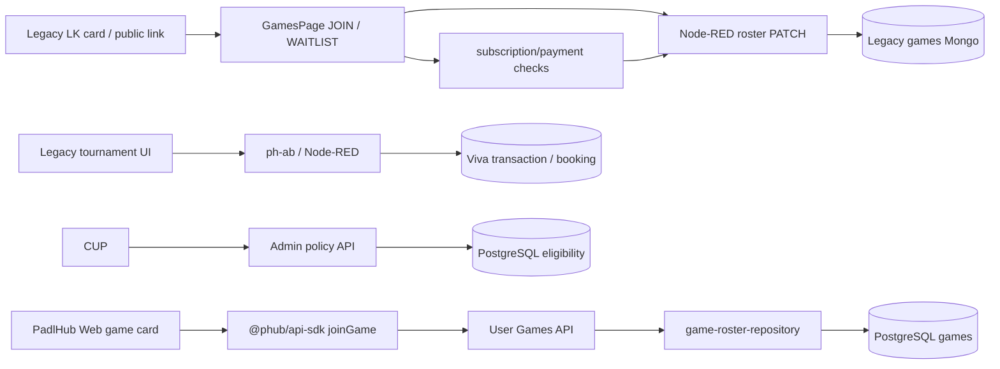
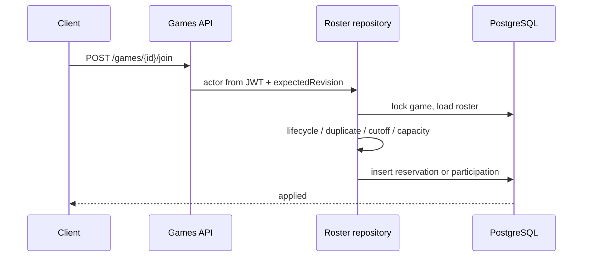
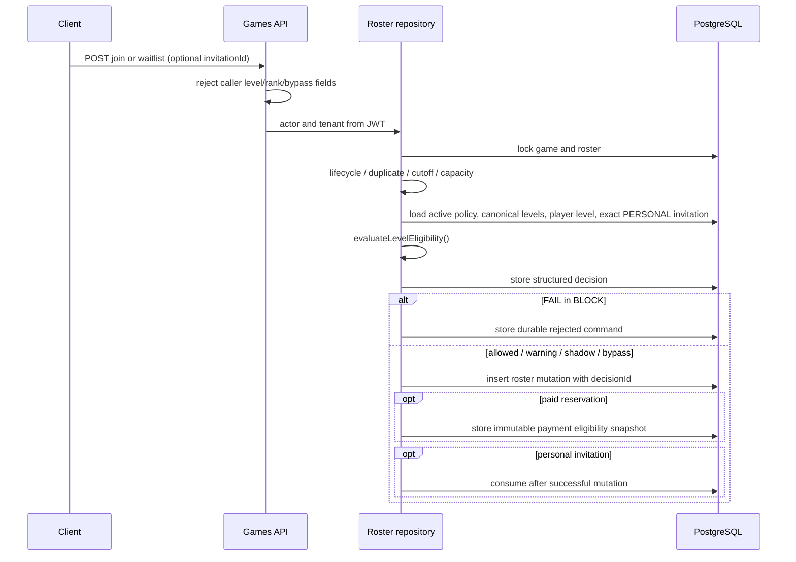

# Current state audit: participation eligibility by level

Date: 2026-08-16
Scope: `project-fixed 6` (legacy LK/Node-RED), `ph-ab` (current CUP/rating backend), and this PadlHub platform repository (`lk2`).
Audit mode: source/history inspection plus a read-only pull of the live Node-RED flow on server 147. No migrations, writes, deploys, or provider API calls were made.

## Executive finding

Before this change there was no common Participation Eligibility engine. Subscription/payment checks existed in legacy LK flows, but level restrictions were presentation data or client-side hints. The authoritative PadlHub game roster command checked lifecycle, duplicate participation, cutoff and capacity, then wrote a reservation/participation without loading a player level, policy or invitation. Legacy LK could mutate roster arrays directly, and tournament/training mutations still terminate in legacy Node-RED/Viva contours.

The current change establishes the first canonical rule and authoritative game-command integration in `@phub/domain` and `@phub/database`. It does **not** make the legacy tournament/training writers authoritative PadlHub writers. Their policy remains seeded `OFF`, and their CUP impact rows are explicitly `supported=false` until those commands migrate.

## Service map

| Contour                     | Current owner            | Relevant source                                                               | Finding                                                                                                                                           |
| --------------------------- | ------------------------ | ----------------------------------------------------------------------------- | ------------------------------------------------------------------------------------------------------------------------------------------------- |
| Legacy LK games UI          | `project-fixed 6`        | `src/pages/GamesPage.tsx`                                                     | JOIN/WAITLIST can construct a player with `source='INVITE_LINK'` and PATCH roster/waitlist; public and personal links are not distinguished.      |
| Legacy game persistence     | Node-RED + Mongo         | `scripts/nodered_*`, live flow on server 147 is release source of truth       | Final mutation is outside the PadlHub transaction. A client precheck would not close this boundary.                                               |
| Legacy payment/subscription | LK + Node-RED/Viva       | `src/api/tournamentSignupApi.ts`, Games handlers                              | Subscription/payment applicability runs before some roster writes, but is not a general Participation Eligibility service.                        |
| Current CUP/rating backend  | `ph-ab`                  | `src/player-ratings/*`                                                        | Mongo `player_rating_state` is current numeric 1..7 CUP canonical ledger (`ownership='CUP_CANONICAL'`).                                           |
| Tournament mutation         | `ph-ab` + legacy LK/Viva | `src/tournaments/tournaments.controller.ts`, `src/api/tournamentSignupApi.ts` | Identity/level data can be accepted from request/body in legacy adapters; ordinary signup/payment goes directly to legacy/Viva transaction paths. |
| PadlHub profile projection  | `lk2`                    | `packages/database/src/player-level-repository.ts`, migrations `0044`, `0084` | Authenticated self-declared and server-evaluated onboarding writes update profile and sport-level projections atomically.                         |
| PadlHub game aggregate      | `lk2`                    | `packages/database/src/game-repository.ts`                                    | Game had legacy `level_from/level_to`; organizer is inserted as ORGANIZER during create.                                                          |
| PadlHub roster command      | `lk2`                    | `packages/database/src/game-roster-repository.ts`                             | Final join/waitlist/promotion transaction is the correct enforcement point.                                                                       |
| CUP web                     | `lk2`                    | `apps/cup-admin/src/App.tsx`                                                  | Existing settings surface had locations only; no level policy editor/history/preview.                                                             |
| Public discovery            | legacy LK + `lk2`        | `src/pages/FindGamePage.tsx`, `apps/web/src/GamesPage.tsx`                    | Public discovery/link navigation is not evidence of a personal invitation.                                                                        |

## Current call graph

The red boundary is architectural, not visual: `LegacyPatch` and `TournamentAPI` do not call the PadlHub final command. They cannot be made authoritative by adding React validation.

## Game flow before and after this change

### Before

### Implemented PadlHub target

Waitlist promotion repeats the same lookup and decision in the promotion transaction. A denied candidate is terminally removed from the active queue, a decision is attached, and the next promotion command is scheduled.

## Tournament flow

The current public/read model in `lk2` is an adapter: `LegacyTournamentSummaryAdapter` in `packages/legacy-games-adapter` and `apps/api/src/main.ts`. There is no native tournament command aggregate in this repository.

Legacy signup/payment paths are in `project-fixed 6/src/api/tournamentSignupApi.ts` and related LK screens. Ordinary operations post to Viva transaction/booking endpoints; server-only special subscription/custom-energy branches do not create a universal participation gate. In `ph-ab/src/tournaments/tournaments.controller.ts`, `resolveLkClient` historically accepts body/header phone/name/level hints before/alongside JWT-derived context. That is not an acceptable final eligibility identity boundary.

Result: tournament policies may be authored and previewed in CUP, but `BLOCK` must remain operationally prohibited until tournament registration becomes a server-owned PadlHub command or a trusted server-to-server adapter derives activity/player facts.

## Training flow

`apps/web/src/TrainingsPage.tsx` is discovery/filtering over event catalog/Viva projections. Booking mutation remains a client-assisted/legacy provider contour; there is no native training participation command in `lk2`. Level range is display/filter data and cannot be treated as final enforcement.

Result: same activation gate as tournaments. Do not send a synchronous Viva read on every preflight/join; migrate or project the needed training constraint locally first.

## Existing subscription/payment rule layer

The legacy flow evaluates subscription applicability, visit balance, station/type/duration/daily constraints and payment mode in the LK/Node-RED/Viva boundary. It is payment eligibility, even where naming says “eligibility.” It is not a general activity participation orchestrator and is not called for every free/direct roster mutation.

Target ordering is therefore:

1. Authenticated actor/tenant.
2. Activity state, duplicate, capacity/waitlist.
3. Server validation of a personal invitation.
4. Participation level rule.
5. Subscription/payment applicability and limits.
6. Reservation/payment initiation.

This change implements steps 1–4 plus the decision snapshot for PadlHub game commands. It intentionally does not copy subscription formulas into `@phub/domain`.

## Data sources and formats

### Player level

| Source                                | Format                                                       | Status                                                                                    |
| ------------------------------------- | ------------------------------------------------------------ | ----------------------------------------------------------------------------------------- |
| `ph-ab.player_rating_state`           | numeric 1..7, CUP canonical ledger                           | Current operational rating owner outside `lk2`.                                           |
| Legacy LK profile/rating              | numeric plus grade                                           | Contains a conflicting grade threshold mapping in `src/services/player-rating/ledger.ts`. |
| `lk2.profile.user_summaries`          | `level_label` D, D+, C, C+, B, B+, A; optional `level_value` | Existing local presentation projection.                                                   |
| `lk2.eligibility.player_sport_levels` | tenant/player/sport + levelId/source/scaleVersion            | New target participation-level projection. Seeded from valid profile labels.              |

Two different numeric-to-grade mappings were found: legacy ledger thresholds (`2.5/3/3.5/4.2/5/6`) differ from ph-ab/LK UI/API boundaries (`2/3/3.5/4/4.7/5.5`). Therefore this implementation does not recalculate a grade from a numeric value. It migrates only an already normalized label and compares canonical ranks.

### Activity constraints

| Activity     | Current format                                                        | Normalization                                                                                                           |
| ------------ | --------------------------------------------------------------------- | ----------------------------------------------------------------------------------------------------------------------- |
| PadlHub game | `games.games.level_from/level_to`                                     | Migration resolves labels to canonical level IDs; unresolved/partial ranges are invalid and cannot silently hard block. |
| Legacy game  | `minRating/maxRating`, `rating*`, level/access fields, sometimes text | Needs one adapter during writer migration. Public-link source is not personal invite proof.                             |
| Tournament   | legacy/Viva fields and display range                                  | No authoritative local mutation/constraint owner yet.                                                                   |
| Training     | Viva/event catalog range/filter fields                                | No authoritative local mutation/constraint owner yet.                                                                   |

Legacy inventory requiring adapter coverage: `minRating`, `maxRating`, `ratingFrom`, `ratingTo`, `ratingMin`, `ratingMax`, `rating`, `level`, `grade`, `ratingNumeric`, `levelNumeric`, `numericRating`, `accessLevels`, and `ratingGame`. Text extraction must be tagged `LEGACY_TEXT_FALLBACK` and never produce a hard block.

## Invitations

The legacy game UI uses “invite link” as a navigation/source label. Public cards can route to the same URL or `joinGame` query and therefore cannot distinguish PERSONAL from PUBLIC_LINK.

The new table requires tenant, activity type/id, invitation type, exact recipient, status, expiry, revocation, use count and creator. Only an active `PERSONAL` record addressed to the JWT actor and same game produces `PERSONAL_INVITE_BYPASS`. COMMUNITY, TEAM, ADMIN and PUBLIC_LINK do not. ADMIN requires a future separately authorized audited override, not an invitation flag.

## Creation and organizer auto-participation

`packages/database/src/game-repository.ts` inserts the organizer directly during aggregate creation. This is the natural `CREATE_ACTIVITY_WITH_ORGANIZER_PARTICIPATION` bypass and should not be routed through ordinary join. The pure rule restricts `ORGANIZER_CREATION_BYPASS` to creation actions; a later rejoin uses the normal check.

## Waitlist, payment, callback and recovery

- Join waitlist: final PadlHub command now checks the same rule.
- Promotion: previously checked only queue order/capacity; now re-evaluates and continues to the next candidate after denial.
- Payment initiation: paid game reservation now stores the exact decision snapshot before downstream payment work.
- Callback/recovery: no new callback rejection was added. Existing callbacks should continue using the reservation/operation created from the snapshot and recheck only critical state/idempotency/security.
- Tournament/training callback and reconcile remain legacy; they do not yet reference the PadlHub snapshot.

## Idempotency, audit, RBAC and rollout

- Roster commands retain `games.command_idempotency` and game row locking.
- Policy publication has a tenant-scoped request-hash journal; retry with the same key/body replays, key reuse conflicts.
- Each publication deactivates the previous row, inserts an immutable next version and writes `audit.audit_log` old/new values and actor.
- CUP read requires `eligibility.read|manage|publish`; publication/rollback requires `eligibility.publish` plus admin audience and `X-App-Platform: cup-admin`.
- Initial GAME/TOURNAMENT/TRAINING policies are `OFF`, tolerances zero. BLOCK publication is rejected until all four activation-readiness gates are verified.

## Git history evidence

History/blame inspection showed:

- `game-roster-repository.ts` promotion logic originated as queue/capacity handling and did not re-evaluate level.
- `ph-ab` tournament LK client resolution prioritizes legacy request identity fields around the JWT compatibility boundary.
- legacy onboarding validation accepts source/client metadata from the request boundary; tests cover projection, not a modern authorization boundary.
- no PERSONAL activity invitation aggregate or payment eligibility snapshot existed.

Exact commit provenance remains in the repository histories; no historical commit was rewritten.

## Live legacy onboarding evidence

The fresh read-only audit of server 147 selected the live **LK Onboarding** contour from source
SHA-256 `d9ae9ef519f5f1e1bc474ebd7aff955b20721af3467c92f079cf6f68dc26c76a` (4,734 total
nodes; 21 selected; two HTTP inputs). The `/lk/onboarding/level` input is wired directly to its
normalization handler. That handler accepts `clientId`, result level/numeric value and provenance
such as `source`/`changedBy` from the request before writing through a service-token Viva call. No
verified PadlHub principal is established on that route.

Therefore the legacy route remains a compatibility writer, not trusted `ONBOARDING` evidence. It
was not patched or deployed. Native PadlHub onboarding now uses the authenticated User API: the
client fetches a scoring-free, versioned question definition and submits only option IDs; the
server validates the branch, calculates the result and persists source `ONBOARDING` for the JWT
player. A future legacy bridge must call this authenticated command or an equivalent narrowly
scoped server-to-server adapter instead of forwarding a client-computed result.

## Client bypasses found

1. Legacy LK can PATCH roster/waitlist without the new PadlHub command.
2. Public link and personal invitation are conflated client-side.
3. A client-only precheck can be disabled or an old bundle replayed.
4. Legacy tournament identity/level hints can originate in body/header compatibility data.
5. Preflight without final transactional recheck has a TOCTOU gap.
6. Waitlist promotion previously skipped level evaluation.
7. Payment without a snapshot can be inconsistently re-evaluated after policy/level changes.

The new User Games API accepts only `expectedRevision` and `invitationId`; attempts to send `playerId`, `playerLevelId`, `rank`, `personalInvite` or `skipLevelCheck` are rejected. The profile-level command accepts only `sportCode` and a canonical `levelId`; actor, source and rank are server-derived. The assessment command accepts only sport, assessment version and selected option IDs; client-computed score, label, rank, source and player identity are rejected.

## Backward compatibility plan

1. Deploy expand-only schema and code with all policies OFF.
2. Keep existing registrations and payments untouched.
3. Populate/continuously synchronize canonical player sport levels and activity constraints from trusted local projections; do not query Viva per click.
4. Route legacy game writer calls to the PadlHub game command. Do not add a second formula to Node-RED/React.
5. Migrate tournament and training final commands or add trusted server-side adapters with local activity projections.
6. Run SHADOW and compare decision distributions; clean missing/invalid/legacy constraints.
7. Use the implemented SELF_DECLARED or trusted ONBOARDING recovery for native games, then extend
   the same resume contract to tournaments and trainings.
8. Enable WARN and then BLOCK independently per tenant/sport/activity only after impact and rollback rehearsal.

## Activation blockers

- No continuous authoritative bridge from current `ph-ab` numeric rating ledger into `eligibility.player_sport_levels` has been implemented.
- Legacy LK/Node-RED game mutation can still bypass the PadlHub command.
- Tournament/training/admin-add/invite-acceptance final mutations are not native PadlHub commands.
- Native game SELF_DECLARED and trusted ONBOARDING recovery are implemented;
  tournament/training recovery is not.
- Native ONBOARDING does not yet project the result back to Viva; legacy profile views may drift
  until a transactional outbox/adapter is added.
- Legacy payment callbacks/recovery do not consume PadlHub payment snapshots.
- Waitlist denial notification is not yet emitted, although the queue continues and the reason is durable.

Therefore production `BLOCK` is a NO-GO at this checkpoint. `OFF` is safe; `SHADOW` is appropriate only after projection freshness and legacy writer routing are proven.
