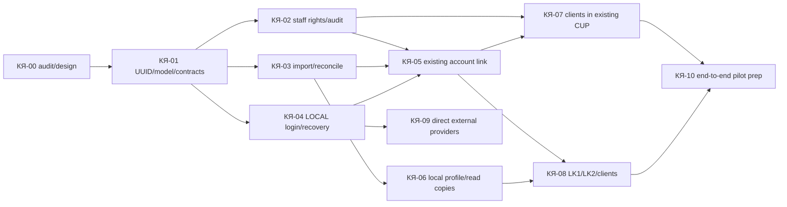

# КЯ-00 — исполнимый backlog

Статус: **Proposed**. Оценки ниже — инженерные дни одного исполнителя при доступном checkout и согласованных контрактах, а не календарь и не обязательство Viva. Внешние согласования, PR/CI, QA и пилот считаются отдельно. Основа: [AUDIT.md](AUDIT.md), [ARCHITECTURE.md](ARCHITECTURE.md), [MIGRATION_AND_ACCEPTANCE.md](MIGRATION_AND_ACCEPTANCE.md). Путь `ph-admin` относится к отдельному read-only на КЯ-00 репозиторию.

| Задача, outcome | Репо и реальные точки; scope / non-goals | Зависимости, риск, оценка | Acceptance и проверки | Восстановление и внешние блокеры |
| --- | --- | --- | --- | --- |
| **КЯ-00** Проверяемый проект, этот комплект | `lk2:docs/plans/customer-core/*`; только документы, без runtime | Нет; R0 по diff, identity дизайн требует security review; 2–4 д., средняя | 5 docs, evidence links, конфликт 0091 и ph-admin плана, backlog, review | Правка документа; GitHub API/PR доступ может блокировать публикацию, не локальный результат |
| **КЯ-01** Одна UUID модель и контракт | `lk2:packages/database/migrations`, `packages/database/src/auth-repository.ts`, `packages/auth/src/index.ts`, `contracts/openapi/{user,admin}/v1`, tests; add contact/login separation и version, без login implementation | КЯ-00; CRITICAL schema/PII/API; 6–10 д., низкая | Существующий user UUID сохраняется, imported user без login; общий contact не ломает уникальный login; tenant/RLS/duplicate race/expand compatibility tests, `npm run check` | Expand-first, старый read path до проверки; schema rehearsal на disposable PG отдельно, миграция real target позже; owner решения о контактах/retention |
| **КЯ-02** Staff authz, audit и эксплуатационная основа | `lk2:apps/api/src/admin`, `packages/auth`, `packages/database`, admin OpenAPI; backend-issued staff delegation, авторитетные station grants и customer/block-to-station relation, PII allowlist/metrics, без UI | КЯ-01; CRITICAL auth/PII; 7–12 д., низкая | Consumer session/recovery и spoofed `X-App-Platform` не дают `customers.*`; чужой tenant/station deny, unmapped/stale grant deny, shared customer раскрывает разрешённые блоки; actor из verified staff token, reason+audit+idempotent replay; negative tests, security review, check | Feature unavailable/fail closed; ph-admin staff identity/exchange и station mapping между ph-admin и LK2 — обязательный внешний контракт |
| **КЯ-03** Повторяемый импорт и сверка | `lk2:apps/worker/src`, `packages/viva-adapter/src`, `packages/database/src`, `packages/database/migrations`; full+delta parser/ledger/quarantine, без live backfill | КЯ-01; CRITICAL PII/external data/recovery; 8–15 д., низкая | Synthetic full/delta/replay/out-of-order/tombstone, checkpoint, counts/hash, protected local verified fields, lag metric; check | Остановить worker, продолжить с checkpoint, forward repair; Viva export/delta contract, legal retention и архив старых обязательств — внешние блокеры |
| **КЯ-04** Независимый LOCAL вход и восстановление | `lk2:apps/api/src/auth`, `packages/auth`, `packages/database`, User OpenAPI/SDK; password setup/login/recovery, contact proof, session APIs; без переключения tenant | КЯ-01/02; CRITICAL auth/PII; 8–14 д., низкая | Viva отключена: новый local user входит/восстанавливается, UUID стабилен; shared contact alone не восстанавливает чужой аккаунт; password reset отзывает старые access/refresh families атомарно и concurrent rotate не воскресает; abuse/race/replay/last-method/default-deny tests; check | Fail closed, при обычном rollout stop сохранять текущие sessions, при credential reset отзывать затронутые; SMS/email provider договор, тариф/лимиты и delivery — внешние |
| **КЯ-05** Явная привязка прежнего клиента | `lk2:apps/api/src/auth`, `packages/database/src/auth-repository.ts`, `packages/viva-adapter`; reauth уже привязанным методом + proof нового либо независимое account-specific recovery; без merge по телефону/email | КЯ-02/03/04; CRITICAL identity; 5–9 д., низкая | Existing UUID после link, только новая контактная OTP плюс сессия отклонены, shared contact не выбирает аккаунт, конфликт subjects в quarantine, lost-session path, concurrent bind unique, audit/negative tests | Freeze new links и forward repair; источник доказательства Viva identity/архив необходим |
| **КЯ-06** Локальный профиль и read-only commercial copies | `lk2:apps/api/src/profile`, `packages/database`, `apps/web/src/ProfilePage.tsx`; отделить sourced/asOf blocks; без purchase/write-off/booking | КЯ-03/05; FAST UI + CRITICAL PII/API в backend, 7–12 д., низкая | GET profile при Viva outage из одной local snapshot; old obligations complete/unknown, fresh labels; authorized read, privacy/empty/visual tests, check | Вернуть чтение прежней проекции без потери локальных правок; архив/retention и domain data contract блокеры |
| **КЯ-07** «Клиенты» в действующем ЦУП | `ph-admin:client-sdk/phab-admin-panel.js`, `src/auth`, возможно узкий BFF; `lk2:apps/api/src/admin`, admin SDK; без отдельной customer UI в `apps/cup-admin` | КЯ-02/05/06; CRITICAL staff PII, 7–12 д., низкая | Search/card/correct/recovery/revoke/conflict history через LK2 Admin API; station/role deny; UI/a11y/readback; no browser-supplied role | Выключить UI entry, API fail closed; staff delegation contract и ph-admin release owner |
| **КЯ-08** Переход клиентов | `lk2:apps/web/src`, mobile adapters, API SDK; `lk:src/context/*`, cabinet; Tilda integration later. Без миграции коммерческих writer | КЯ-04/05/06, затем КЯ-07 для staff readiness; CRITICAL auth/client compatibility, 8–15 д., низкая | Existing/new user login+profile, UUID parity, session refresh, Viva blocked, LK1/LK2/mobile/Tilda contract tests | Поэтапно переключить только доказанный клиент/tenant; нет cohort routing сейчас — сначала механизм или tenant pilot; client release owners |
| **КЯ-09** Прямые внешние входы | `lk2:apps/api/src/auth`, `packages/auth`, `apps/web/src`, mobile; Яндекс ID/Сбер ID/Т-ID по отдельным контрактам; не часть first login | КЯ-04/05; CRITICAL external auth; 4–8 д. **на провайдера**, низкая | Issuer/audience/nonce/PKCE/subject/relink/revoke/negative tests; independent vendor proof | Отключить конкретную кнопку и сохранить LOCAL; commercial/claims/provider docs blocker |
| **КЯ-10** Сквозные испытания и пилот readiness | `lk2` runbooks/tests, `ph-admin`/`lk` smoke сценарии; подготовка, не deploy | КЯ-03..08; CRITICAL/R4 при live cutover; 6–12 д., низкая | Матрица в MIGRATION_AND_ACCEPTANCE, restore backup rehearsal, lag/coverage, no duplicate/tenant/station proof, pilot go/no-go | Stop/forward repair; provider contract, legal/security/operations sign-off, target authority для live |

**Первый полезный результат**: после КЯ-01/02/04 новый локальный клиент может войти и увидеть локальный минимальный профиль, пока Viva недоступна; старые аккаунты этим ещё не мигрированы. **Первый релиз заявленной бизнес-цели** требует КЯ-03/05/06/07/08/10: старый UUID, восстановление, архив старых обязательств и ЦУП. КЯ-09 не блокирует его.

Критический путь: КЯ-01 → КЯ-03 и КЯ-04 → КЯ-05 → КЯ-06/08 → КЯ-10. Не более двух инженерных потоков: (A) один владелец схемы/auth-контракта последовательно 01→02→04→05; (B) после принятой 01 отдельный владелец importer 03, затем profile 06. КЯ-07 может идти после 02/05, но один интегратор синхронизирует admin contract перед 08. Никаких параллельных правок одной миграционной цепочки, auth-контракта или public OpenAPI; интеграционный порядок 01,02,03/04,05,06/07,08,10. Два research-субагента КЯ-00 не являются двумя инженерными потоками.

После ядра отдельно проектировать собственный эквайринг, списания/entitlements и расписание/capacity. Они имеют отдельные owner, деньги и concurrency gates; готовность ядра не включает их cutover.
